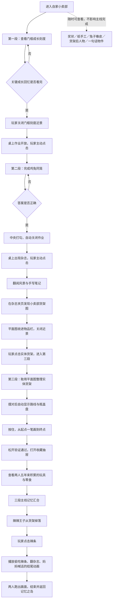

# 第二关记忆房间：小卖部里的秘密

更新日期：2026-10-02  
用途：供 Gameplay、美术、动画与文案协作使用。本文记录本次确定的玩法与顺序，并明确待确认内容；不是已实现功能说明。

### 灰盒实现进展（2026-10-02）

入口构图修订：镜头站在小卖部门口朝店内看。左侧前景仅露出一条带身高刻度的门框，不在后墙绘制另一扇门，也不画包住镜头的完整门洞。店内采用三列陈设：左侧靠墙的冰箱／饮料列、中间向店内延伸的瓶盖谜题货架、最右侧靠墙的零食货架；各列之间留过道。老板的椅子与桌子位于入口右手边前景，作业、后续出现的杂志、纸手工与橡皮都放在这张桌子上。瓶盖与抽屉的互动入口位于中间货架，辣条从这里掉到过道。解锁顺序不变。作业本的点击热点覆盖整张纸，避免视角调整后点偏。

交互修订：房间使用墙角、地面、前景桌面与实体货架构成的空间视角。刻度按身高竖排，点击后在相应刻度旁保留一句回忆；全部看完仍停留在刻度窗口，主动关闭后才开放作业。作业答对后中央勾号显示约0.9秒后自动关闭，桌上出现杂志。玩家另行点击杂志、翻夹页并将货架图收进与第一关共用的物品栏；取得图不会自动进入第三段，必须关闭近景、再点击实体货架。货架内可查看已取得的图并返回货架。所有近景需要先关闭才能操作房间其他物件。

- 入口：本地开发服务地址后加 `?scene=chapter2-room`；例如 `http://127.0.0.1:5175/?scene=chapter2-room`。
- 已接入门框三个年龄观察、完成后开放作业、鸡兔同笼数字输入与判题（鸡23、兔12）、杂志与夹页货架图、可选观察点、收藏抽屉、掉落辣条与点击进入结尾。
- 瓶盖当前玩法：整理货架（八件可交换）→瓶盖散成一个不规则连线图→玩家自己选择起点和岔路，每条连接只能经过一次→打开抽屉。图上不显示箭头或标准答案，失败后可重新尝试。
- 辣辣王子是记忆碎片入口：点击拿到后播放第二关专属回忆动画，不复用第一关动画；动画结束自动回到记忆之岛并点亮第二段记忆。
- 回岛后章节列表显示第二关“记忆已点亮”，第三关“已解锁 · 等待闯关”；第三关入口暂只显示状态，不提前进入未完成的玩法。
- 第三关入口点击后先提示“未完待续”，再显示“是否查看后续关卡预告”；确认后播放单独的第三关站位预告，约 3 秒后回到记忆之岛。
- 结尾目前是六幕可点击分镜灰盒，有人物方块、文字与简单动作。点击“下一幕”或按空格推进，最后返回记忆之岛；正式美术、配音与动画待接入。
- 关闭观察窗口保留本次房间流程；“重玩”或刷新从门框重新开始，尚未接入跨刷新存档。
- 下文第10节的旧三线索／光球描述是替换前背景，目前已由上述灰盒替换。

## 1. 场景与人物

- 时间与美术参考：2008—2010年前后。
- 地点：主角家经营的小卖部。十二岁的主角与好友逃课后，来到这里。
- 主角：韩梅梅。口述中的“海妹妹”“李梅梅”暂统一为韩梅梅。
- 好友：前文确定为李雷，两人已相识五年，即约七岁时成为朋友。
- 父母支持主角探索世界。房间不设置因家庭阻拦而秘密攒旅费的情节。
- 妈妈不允许吃辣条属于生活中的饮食管教，与支持探索远方不冲突。
- 情绪：温暖、调皮、好奇，最后以两人偷吃辣条被发现的喜剧收尾。

## 2. 总玩法图与强制顺序

采用明确的状态解锁，不能仅依赖玩家注意力引导来保证顺序。

| 阶段 | 可以做什么 | 尚未开放的内容 | 完成后变化 |
| --- | --- | --- | --- |
| 初入房间 | 门框刻度、可选观察 | 作业保持合拢；杂志夹页与瓶盖谜题不可操作 | 看完关键刻度，作业自动摊开 |
| 作业开放 | 解鸡兔同笼，可回看门框 | 不能提前取货架图、移动谜题商品或操作瓶盖盘 | 答对后露出并开放杂志 |
| 杂志开放 | 翻页、看海与笔记 | 未发现夹页货架图时，货架机关仍未开放 | 查看货架图后开放货架与瓶盖互动 |
| 瓶盖谜题开放 | 整理货架、对照自动出现的路线在瓶盖上连续画一笔 | 收藏抽屉保持关闭 | 一笔画完成，打开抽屉 |
| 收藏回忆完成 | 回看已完成互动 | 尚未点击掉落辣条时不播放动画 | 辣条掉落并等待点击 |
| 结尾动画 | 观看动画 | 暂停房间谜题操作 | 播放结束后衔接记忆之岛 |

锁定阶段点击作业不进入题目、不推进状态；物件保持可见，但不呈现可解谜的按钮。货架上的普通观察与移动商品的谜题操作分开，避免提前操作跳过主线。

## 3. 第一段：门框上的成长刻度

目的：呈现五岁到十二岁的成长，以及父母陪伴、五年友情。保持轻量观察，不增加密码或收集任务。

建议设置三个关键回忆点：

| 年龄 | 短暂回忆内容（演出建议） | 信息 |
| --- | --- | --- |
| 五岁 | 爸爸或妈妈量身高，韩梅梅偷偷踮脚 | 家庭温暖，主角小时候的调皮 |
| 七岁 | 门框旁第一次出现李雷的刻度，两个人比身高 | 五年友情的起点 |
| 十二岁 | 两人站在旧刻痕旁，比小时候高了许多 | 时间流逝，两人仍一起玩 |

三个点可在本段内自由点击。记录已看过的回忆，不要求反复点击或固定年龄顺序。全部看完后关闭局部观察，镜头或声音引导至桌面，作业本自动摊开，解锁第二段。

## 4. 第二段：桌上没写完的作业

### 4.1 鸡兔同笼

作业摊开后，玩家点击进入题目近景。是一道实际可解答的数学题，不采用之前讨论的存钱迷宫。

建议题面：

> 笼子里有鸡和兔，共有35个头、94只脚。鸡和兔各有多少只？

- 两个独立答案栏：鸡〔 〕只，兔〔 〕只。可用点击数字栏与屏幕数字输入，兼容鼠标与触屏。
- 正确答案：鸡23只，兔12只。验算：23 + 12 = 35；23 × 2 + 12 × 4 = 94。
- 提交正确才完成本段；不能只填对一个栏就通过。
- 答错允许原地修改，不计时、不清空已有答案、不重置房间。
- 可选提示只在玩家主动点击草稿区域时出现：先假设全是鸡，再比较少了多少只脚；不直接自动展示答案。
- 具体题面数值属于当前建议，可以调整；鸡兔同笼作为玩法已确定。

### 4.2 杂志、远方与夹页图

答对后，作业本合起或移到旁边，露出一直压在下面的杂志。通过实体动作呈现，不让杂志凭空出现。

杂志内容是一组海另一边的风景图。主角在旁边写着：

> 海的另外一边是什么样子呢？

玩家翻阅杂志，在夹页中发现小卖部货架布局图。点击展开图后，才开放第三段的货架与瓶盖操作。图只提供货架结构和部分关系线索，不能直接给出完整解法。

这一段说明：韩梅梅学习不错，也会写作业写到一半做手工、翻杂志、想远方。不要把逃课与不爱学习简单画等号。

## 5. 第三段：货架、瓶盖盘与收藏抽屉

这是本房间最长、难度最高的谜题。瓶盖来自两人五年来喝汽水的积累；无需玩家去房间各处收集。

### 5.1 整理真实货架

- 采用九格货架作为初稿，一件商品固定，八件可移动。
- 货架图提供结构与部分位置关系；货架本身提供尺寸、罐底印、残留图案和两人涂鸦等线索。
- 玩家结合线索，推理并还原商品布局。
- 第一版格位与线索已实现；自动穷举八件可移动商品的40320种排列，确认仅一个解满足全部线索。
- 商品摆错允许调整，不能丢失商品或卡死。合适的尺寸反馈可以即时提供，但不应每摆一格就直接提示答案对错。

### 5.2 货架上的路线与瓶盖一笔画（最新玩法）

货架正确后，右侧出现九枚散开的瓶盖和一张无箭头的连线图。玩家自己选择起点和岔路，每条连接只能经过一次，松开时如果整张图都走完才完成。

- 不再交换瓶盖、翻面、镜像或记顺序回到货架拉商品。
- 不显示起点、终点或标准答案，玩家需要观察岔路，避免提前堵死未走的连接。
- 走错连接或中途松开只清掉本笔，不重置货架；可以从任意瓶盖重新尝试。
- 关闭近景会取消正在画的笔画，重新进入仍在一笔画阶段。
- 成功后打开收藏抽屉，接原有回忆汇合与辣条掉落。

### 5.5 收藏抽屉与第三段完成

抽屉是五年来持续使用的共同收藏处，并非封存五年未动。建议内容：

- 玩旧的小飞行玩具，暂按竹蜻蜓／塑料蜻蜓方向预留，具体样式待确认。
- 不同花纹的玻璃弹珠。
- 小玩具、游戏卡片、折纸、糖纸。
- 最近吃到一半、折口收好的小零食。
- 更多旧汽水瓶盖。

打开抽屉后播放一次短的收藏物展开／回忆演出，演出完成即记为第三段完成。抽屉内单件物品可继续点看，但不要求全部点完才能过关，也不额外塞入第四道谜题。

## 6. 场景中的可选交互

这些交互丰富人物，不计入三个主线完成条件。玩家进入房间后即可查看；每次只打开一个局部观察或文字框，关闭后回到原阶段。

| 交互点 | 点击表现 | 叙事作用与文案状态 |
| --- | --- | --- |
| 一句话观察物 | 点开只出现一句短文字，无题目、无物品奖励 | 具体物件与句子待定，保留这种轻互动形式 |
| 货架后露出的屁股 | 点击露出的部分，人物探出／钻出货架，出现一句话 | 体现孩子躲藏玩闹。用户本次称出来的人为“李梅”，与前文好友李雷不一致，人物名与台词均待确认，不擅自增设新角色 |
| 墙上的“三好学生”奖状 | 放大后能读到“韩梅梅”的姓名及奖项 | 告诉玩家主角学习很好；不是所有调皮孩子都成绩差。年份与学校名按时间线统一 |
| 作业旁的纸手工 | 点击近看折痕与制作细节，显示一句短说明 | 主角暂时不想写作业，磨蹭时做的。口述物件为“小凿”附近读音，具体是纸船、纸爪或其他形状待确认，不先定造型 |
| 兔子形橡皮 | 点击放大，看见被刻成小兔子的橡皮和使用痕迹 | 同样表现写作业时分心做手工；只展示完成品，不增加制作小游戏。建议临时文案：“题还没写完，橡皮已经变成兔子了。” |

奖状与手工可以摆在桌面附近，让“学习好”和“会调皮、会拖延”同时成立。所有建议文案在正式配音或烘焙进美术前再确认。

## 7. 三段汇合：辣辣王子作为结尾信物

- 门框、作业与杂志、货架瓶盖三段全部完成后，主线记忆汇合。
- “汇合”指三个主线完成状态齐全，不要求把可选观察点全部点击，也不新增四处找碎片的任务。
- 一包游戏内虚构品牌“辣辣王子”从货架上掉下来，落在可见、可点击的位置。
- 作用对应第一间记忆房的贝壳：作为进入结尾动画的实体信物。
- 掉落仅触发一次。掉下后等待玩家主动点击，不自动播放动画。
- 品牌统一用“辣辣王子”；真实品牌只作为口述参考，不将其当作2008—2010年包装史料依据。
- 结尾动画中出现的两人拿到辣条的过程，可通过落地位置、伸手取包装的动作与房间点击衔接。

## 8. 结尾动画分镜与对白

动画主题：两个人第一次尝到辣辣王子，觉得特别好吃；在偷吃的欢乐中聊起远方，被妈妈发现后一起跑走。

| 镜头 | 画面与动作 | 声音／对白 |
| --- | --- | --- |
| 1. 偷偷拆开 | 点击信物后切入记忆。两人凑在柜台或货架旁，确认没人注意，拆开辣条包装 | 包装摩擦声；两人压低声音，暂不定台词 |
| 2. 第一口 | 各拿一根，试探着咬一口，短暂停顿，然后互相看一眼 | 可用短暂安静突出反应 |
| 3. 好吃又辣 | 夸张但可爱的喜剧反应：眼睛亮起、脸红、扇嘴，又忍不住再吃。可选短暂幻想背景或漫画效果 | 咀嚼、吸气、笑声；具体搞笑效果由动画设计，不表现痛苦受伤 |
| 4. 开心分享 | 两人边吃边分享。韩梅梅把风景杂志翻开，招呼好友凑过来看 | 韩梅梅：“你过来看。”（衔接建议） |
| 5. 想象远方 | 镜头带到海与远方风景，再回到两人看杂志的侧脸 | 韩梅梅：“你说，海那边是什么样子呢？” |
| 6. 妈妈的声音 | 妈妈尚在画面外，声音从远处传来，两人动作同时停住 | 妈妈：“韩梅梅！你怎么又在这里偷吃辣条！跟你说这些垃圾食品不能吃。” |
| 7. 跑出画面 | 两人对视，慌忙拿上辣条，起身跑出画面。杂志留在桌面，停在那片海的跨页 | 急促脚步、包装声；保持轻松、喜剧的节奏 |
| 8. 结束 | 在打开的杂志上短暂停留，然后淡出 | 动画结束后衔接记忆之岛 |

叙事口径：“第一次”指第一次吃到这一款辣辣王子；妈妈的“又偷吃辣条”可指以前吃过其他辣条。若最终想表达人生第一次吃任何辣条，需去掉妈妈台词中的“又”，两者不要混用。

## 9. 美术与时代一致性

- 采用2008—2010年前后的小卖部陈设、练习本、文具、奖状、印刷风格和商品包装。
- 五岁回忆比十二岁早七年；若当前年份最终定为2010年，则五岁约为2003年、七岁约为2005年。更早回忆中的物品不能一律按2010年新品处理。
- 货架商品可先从干脆面、奶糖、泡泡糖、饼干、玻璃瓶汽水等品类选取；具体品牌、包装版式需根据选定年份与地域的图片资料核对。
- 瓶盖盘以真实可产生金属瓶盖的饮料作来源；用于谜题的图案可以是两人后画的，不要求把纸盒饮料也误画成有金属瓶盖。
- 辣辣王子采用原创包装，视觉符合年代。不要直接套用现实品牌的现代包装。
- 抽屉里的玩具允许不同新旧程度：五年的积累通过磨损与使用痕迹表现，不必逐个写年份。

## 10. Gameplay 接入与验收

当前 `src/scenes/ChapterTwoRoomScene.ts` 已实现顺序解锁与瓶盖谜题，`src/scenes/ChapterTwoMemoryScene.ts` 为六幕可点击分镜。画面仍使用灰盒图形，尚未接入正式美术与配音。

后续替换方向：

- 门框、作业／杂志、货架／瓶盖流程已经串联；Gameplay 后续可调整难度与操作演出。
- 辣辣王子已替换光球，掉落后等待玩家点击进入分镜。
- 正式动画可替换六幕分镜，沿用章节完成后返回记忆之岛的衔接。
- 主线进度与可选观察记录分开。局部弹窗关闭、错答、画线失败均不应清空前段完成状态。
- 完成动画、掉落信物和章节结算均防止重复触发。

验收重点：

1. 未看完刻度，无法进入作业题；关闭并重开观察不会绕过限制。
2. 数学题未通过，无法获得货架图；未查看货架图，不能操作第三段谜题。
3. 货架排列线索可推导且答案唯一，参考路线与瓶盖画线判定一致。
4. 错误操作可以恢复，不要求重新完成已通过的阶段。
5. 不点击奖状、手工等可选内容，也能完成房间。
6. 三段完成后只掉落一次辣条，玩家点击前不会自动切动画。
7. 结尾使用韩梅梅、好友与辣辣王子的统一口径；人物名确认后再制作字幕与配音。

## 11. 制作前仍需确认的少量内容

- 货架后钻出来的是李雷，还是确有名为“李梅”的另一个人物？该处一句话由用户后定。
- 纸手工的确切形状，以及“吹蜻蜓”对应的具体玩具样式。
- 故事当前年份在2008—2010中选哪一年，以统一奖状、身高刻度、回忆和包装。
- 九格货架的最终商品、线索、正确排列与一笔画路线，需要在灰盒阶段作为同一套谜题验证。

其余已确定主线不依赖以上文案和美术细节。

## 12. 当前版答案与验证（替代旧翻面拉绳版）

鸡兔题答案为鸡23、兔12；交作业正确后中央显示勾号约0.9秒，自动关闭并露出杂志。未答对则留在题目页。

货架答案从上到下、每行从左到右：

| 左 | 中 | 右 |
| --- | --- | --- |
| 牛奶 | 橘子汽水 | 葡萄汽水 |
| 饼干 | 干脆面（唯一固定） | 蛋卷 |
| 奶糖 | 泡泡糖 | 酸梅糖 |

七条线索：仅干脆面固定；顶层饮料、底层糖；饼干紧挨干脆面左侧；牛奶在饼干正上方；橘子汽水在葡萄汽水左侧；奶糖与牛奶同列；酸梅糖在泡泡糖右侧。已穷举40320种排列验证唯一解。

一笔画从右上开始，经过上中→正中→中左→左下→下中→右下。右侧瓶盖与左侧参考同向，不镜像，右上为“起”、右下为“终”。从起点按住，画到终点后松开；无需再次提交。

冰箱和右侧普通商品货架仅作陈设，不显示手形或点击弹窗。保留门框、作业、杂志、奖状、纸手工、兔子橡皮、收藏物等有玩法或叙事的交互。

测试覆盖货架唯一解、固定位置、错误与中断笔画、路线完成后松开判定、重试保留布局及完整主线。画面仍为灰盒。
