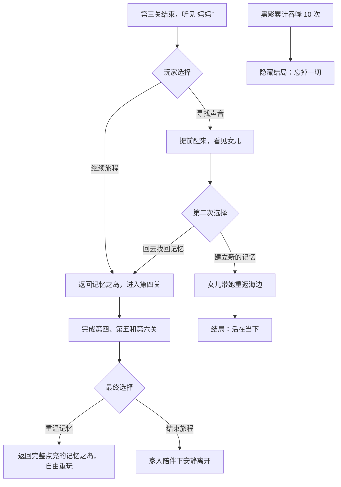

# SEEK 游戏剧情与关卡设计

版本：2026-10-01  
状态：团队讨论稿  
用途：统一主线、六关结构、记忆物件、分支结局和后续制作方向

> 主角定名：**韩梅梅**（2026-10-03 团队确认，见 `decisions/2026-10-03-protagonist-name.md`）。本文以下统一使用该名字；旧素材里的“年年”只是资产技术名，不是剧情称呼。第四关的重要角色暂称“李雷”。

## 一、游戏概念

玩家进入一名老年女性正在消散的意识。她处于弥留之际，也正在失去一生的记忆。游戏开头不向玩家说明真相。玩家会先把眼前的一切理解为一场寻找记忆的冒险，直到后期才发现韩梅梅已经老去，并受到阿尔茨海默症或类似记忆障碍的影响。

六个关卡对应她人生中的六个阶段。玩家完成跑酷或动作关卡，进入一间“记忆之房”调查物件，再将碎片合成一件代表该阶段的记忆物。触碰记忆物后，玩家看到这一阶段真正发生过的往事。每完成一段回忆，记忆之岛就点亮一片街区，并开放下一段人生。

故事讨论的重点是记忆、遗忘、家人与放下。结局让玩家选择继续寻找过去，或者接受眼前仍能建立的新记忆。

## 二、序章

### 1. 弥留之际

画面从模糊的病床视角开始。观众看不清地点，也不知道韩梅梅已经走到生命尽头。声音可以包含呼吸、远处的人声和不完整的呼唤，让现实与记忆混在一起。

### 2. 人生蒙太奇

大量短镜头闪过。镜头取自后续六关，但只展示局部，不解释人物关系：

- 海水打湿衣角，孩子举起一枚贝壳。
- 校服、街道、小卖部和撕开的辣条包装。
- 城市夜景、电脑屏幕、会议桌下传递的纸条。
- 小船、星空、落进船里的酸果子和一碗面。
- 雨伞、积水、孩子踩出的水花和一袋感冒药。
- 老屋、相册、贝壳，以及站在角落里的黑影。

闪回期间，画面中的成年的韩梅梅逐渐变成孩子。镜头随后切入黑屏。

### 3. 第一次触碰相册

韩梅梅以孩子的身体醒来。玩家从第一人称视角看向左右两侧，再看见正前方的一本旧相册。相册是贯穿全篇的核心物件。

韩梅梅伸手触碰相册，第一关由此开始。玩家此时只知道相册和自己有关，并不知道相册来自现实中的女儿。

## 三、核心流程

每一关使用同一套叙事循环：

```text
进入人生阶段
→ 动作／跑酷关卡
→ 找到入口
→ 进入记忆之房
→ 调查物件并完成小游戏
→ 收集记忆碎片
→ 碎片合成该关的记忆物
→ 触碰记忆物
→ 播放本关回忆动画
→ 相册增加一张照片
→ 返回记忆之岛
→ 点亮对应街区并开放下一关
```

### 记忆之岛

记忆之岛是一座可探索的 3D 小古镇。岛上有六座关卡建筑，也有民居、小巷和普通建筑。玩家完成一关后，对应关卡建筑及其周边街区一起恢复色彩。未解锁区域保持灰暗，玩家可以走近查看，但不能进入。

玩家在岛上使用第三人称视角移动，也可以切换到全岛视图。六关全部完成后，岛屿保留自由探索与重玩功能。

### 相册

相册承担三项功能：

- 序章入口：韩梅梅第一次触碰相册，进入童年记忆。
- 章节记录：每段回忆动画结束时，相册增加一张照片。
- 结局揭示：现实中的女儿将相册带到病床前，玩家才理解整场冒险的来源。

### 黑影

黑影代表“遗忘”。第三关开始出现，第六关成为主要威胁。玩家在游戏中累计被黑影吞噬十次，会触发“忘掉一切”的隐藏结局。计数需要跨关卡保存。

## 四、第一关：童年与海边

### 人生阶段

韩梅梅约五至七岁。她和父母生活在海边，拥有轻松、明亮的童年记忆。

### 动作关卡

- 场景：海边、浅滩、礁石和沿海设施。
- 玩法：跳跃、攀爬和基础收集，用作整套游戏的教学关。
- 目标：穿过海边区域，找到进入记忆之房的门。

### 记忆之房

- 地点：韩梅梅童年的小卧室。
- 内容：房间里保留玩具、照片、家庭用品和海边带回来的小东西。
- 解谜方向：通过调查房间物件找出三块记忆碎片。

### 记忆物

三块碎片合成一枚贝壳。贝壳承担本关“记忆之球”的功能。

### 回忆动画

韩梅梅和爸爸妈妈在海边玩。她捡到一枚贝壳送给妈妈，妈妈接过贝壳后突然向她泼水。韩梅梅反击，三个人在浅水里追逐、泼水。动画最后定格成一张家庭照片，收进相册。

### 关卡结束

玩家第一次进入记忆之岛。童年建筑和周边街区恢复颜色，第二座建筑开放。

## 五、第二关：初中、逃课与小卖部

### 人生阶段

韩梅梅进入初中。她开始拥有不愿告诉家长的小秘密，也和朋友建立更独立的关系。

### 动作关卡

- 场景：街道、楼房、巷子、围墙和店铺招牌。
- 剧情：韩梅梅逃课后和朋友在街上玩。
- 玩法方向：翻越围墙、穿过小巷、躲开熟人或巡查者。具体失败条件待设计。

### 记忆之房

- 地点：韩梅梅家经营的小卖部。
- 内容：货架、零食、收银台、旧账本和学生时代留下的物件。
- 解谜方向：玩家从店内线索确认，一直和韩梅梅分享秘密的人正是当年陪她逃课的朋友。

### 记忆物

记忆碎片合成一只“辣辣王子”辣条包装袋。

### 回忆动画

韩梅梅和朋友第一次躲着家长分享辣条。韩梅梅尝过后十分震惊，画面用夸张的光效、味觉特效和动作表现她的感受。两个人随后翻出更多平时不许吃的零食。

结尾传来妈妈的大喊：“你又逃课，还偷吃不让你吃的东西！”两个人一边笑一边逃跑。动画最后生成第二张相册照片。

### 关卡结束

玩家回到记忆之岛。第二片街区恢复颜色，第三座建筑开放。

## 六、第三关：成年、城市与设计工作

### 人生阶段

韩梅梅成年后进入公司，从事设计或插画相关工作。她需要工作维持生活，对当前岗位并不满意，但仍然画画。

### 动作关卡

- 场景：大城市夜景、写字楼、霓虹灯和办公设备构成的平台。
- 障碍：电脑、文件、办公桌和夸张化的“老板”形象。
- 追逐者：黑影第一次正式出现，并在身后持续追赶韩梅梅。
- 玩法方向：玩家收集 PDF、Word 或其他工作文件，将它们组合成可投掷物，击破挡路目标。文件的具体表现和攻击逻辑待设计。
- 通关物：韩梅梅找到一支画笔，用它打开通往记忆之房的门。

### 记忆之房

- 地点：韩梅梅在城市租住的小屋。
- 内容：工作电脑、账单、没有完成的商业设计、画材、私人插画和生活用品。
- 叙事重点：玩家看见她对工作的疲惫，也看见她仍在下班后画自己喜欢的东西。
- 伏笔：屋里摆着一幅未完成的岛屿草图，它是记忆之岛的早期雏形。

### 记忆物

碎片合成一张随手画下的草图。韩梅梅曾在枯燥会议中画过这张图。

### 回忆动画

韩梅梅坐在办公室听领导讲话，同时在纸上画画。她和同事在桌下传纸条、递零食。领导点名后，她没有慌张，而是举起零食问：“你吃点吗？”此处可以保留第二关的辣条作为跨章节呼应。

动画临近结束时，远处传来模糊的“妈妈，妈妈”。声音来自现实中的女儿，并触发全游戏第一次路线选择。

### 第一次路线选择

#### 选择 A：继续完成旅程

韩梅梅暂时忽略呼唤，完成第三段回忆，返回记忆之岛并进入第四关。

#### 选择 B：寻找声音来源

韩梅梅提前从记忆中醒来。她看见女儿，却问：“你是谁？”女儿向她解释两人的关系。玩家随后作出第二次选择：

- **回到原来的记忆，找回自己**：韩梅梅回到记忆之岛，从第四关继续旅程。
- **放下过去，建立新的记忆**：女儿带韩梅梅回到海边。现实海边与童年海边逐渐重叠，韩梅梅虽然无法认出过去，却和女儿度过新的片刻。她在熟悉的海风中安静睡去。该路线解锁暂定成就“活在当下”。

## 七、第四关：李雷、面馆与爱情

### 人生阶段

韩梅梅进入成年后的感情阶段。李雷经营或继承了一家面馆，两人的共同记忆从小镇、河道和面馆展开。

### 进入方式

玩家从记忆之岛进入第四座建筑后，先乘一艘小船前往另一片小镇。短动画沿水路展示面馆和李雷，再把玩家带入动作关卡。

### 动作关卡

- 场景：以紫色为主的梦幻森林，氛围和前三关不同。
- 关系：李雷在前方奔跑，韩梅梅在后方追赶。
- 通关方式：玩家追上李雷并从身后抱住他。两人面前出现一扇门，一起进入记忆之房。

### 记忆之房

- 地点：李雷的面馆。
- 内容：菜单、厨房、旧桌椅、调料、河边带回来的东西和两人的生活痕迹。
- 解谜方向：玩家通过面馆里的多组交互，还原李雷创造某碗面的过程。

### 记忆物

记忆碎片合成李雷为韩梅梅特制的一碗面。

### 回忆动画

两个人躺在小船里看星空。岸边落下一颗果子，正好掉进船里。果子很酸，韩梅梅却喜欢它的味道。李雷以这颗果子的味道为灵感，后来做出她最喜欢的一碗面。动画最后生成第四张相册照片。

### 关卡结束

玩家回到记忆之岛。第四片街区恢复颜色，第五座建筑开放。

## 八、第五关：成为母亲与雨天回家

### 人生阶段

韩梅梅和李雷已经组成家庭，孩子约四岁。

### 动作关卡

- 核心关系：母亲带着孩子共同闯关。
- 玩法方向：可参考双人协作或泡泡堂式机制。单人版本可以让玩家切换控制母亲和孩子，或让孩子跟随并执行简单指令。
- 场景、目标和失败条件待团队继续设计。

### 记忆之房

- 地点：韩梅梅、李雷和孩子共同生活的家。
- 内容：儿童玩具、家庭照片、雨具、药箱和日常用品。
- 解谜方向：玩家通过一家三口的生活痕迹拼起那个雨天发生的事情。

### 记忆物

碎片合成一袋感冒药。

### 回忆动画

李雷撑伞出门接韩梅梅和孩子回家。韩梅梅和孩子玩得兴起，不肯好好打伞，三个人一路踩水、追逐、淋雨。韩梅梅和孩子没有生病，李雷回家后却感冒了，两个人在旁边哈哈大笑。这段日常成为第五张相册照片。

### 关卡结束

玩家回到记忆之岛。第五片街区恢复颜色，最后一座建筑开放。

## 九、第六关：老年、遗忘与最后的家

### 人生阶段

韩梅梅进入老年。她已经忘记许多经历，黑影也从隐约的追逐者变成主要威胁。

### 动作关卡

- 场景：重新使用第一关的海边路线，但时间、光线和细节发生变化。
- 角色：玩家控制老年的韩梅梅。
- 威胁：黑影在关卡中追赶并吞噬场景。韩梅梅需要躲避黑影，找回散落的物件，再进入最后一扇门。
- 叙事作用：同一片海边让玩家直观看到童年与老年的距离。

### 记忆之房

- 地点：韩梅梅和李雷共同生活过的家。
- 陈设：房间摆放前五关出现过的贝壳、零食包装、草图、面和感冒药。这些物件作为环境叙事存在，玩家不再重复解谜。
- 新交互：玩家调查其他生活痕迹，逐步发现韩梅梅已经记不起自己经历过什么。

### 最后的触发物

韩梅梅再次看见第一关的贝壳。她拿起贝壳，童年海边、父母、李雷、孩子和记忆之岛的画面交替闪回，最后进入现实。

### 现实揭示

韩梅梅睁眼，女儿和家人围在床边。女儿问：“妈妈，你醒了？感觉还好吗？”她把那本相册带到韩梅梅面前。相册里正是玩家完成六关后留下的六张照片。

韩梅梅在房间角落看见黑影。她不再逃跑，而是向它打招呼，并意识到自己已经忘记许多事情。完整路线的结尾表现她接受生命即将结束，在家人的陪伴下安静离开。

画面可以把老年的韩梅梅还原成孩子的形象。女儿仍然叫她“妈妈”，并抱住眼前的小女孩。这个形象表达女儿拥抱的是母亲一生中最初、也最完整的那部分自己。

## 十、结局结构



### 结局一：坦然面对

玩家完成六关，在现实中认出相册代表的经历。韩梅梅接受遗忘和死亡，在家人陪伴下离开。

### 结局二：活在当下

玩家在第三关选择离开过去，并在醒来后选择建立新记忆。女儿带韩梅梅重返海边。她无法完整找回旧人生，却在当下与女儿留下新的片刻。

### 结局三：沉溺过去

玩家完成六关后选择暂不结束。韩梅梅回到已经点亮的记忆之岛，可以进入任意建筑重玩关卡。玩家之后仍可回到最终选择。达成沉溺过去的成就。

### 隐藏结局：忘掉一切

玩家在第三关和第六关累计被黑影吞噬十次。韩梅梅失去已经找回的记忆，成为一位无法回想过去的老人。该结局作为失败彩蛋，具体演出待设计。

## 十一、跨章节系统

### 1. 相册照片

每个关卡对应一张照片。照片在回忆动画结尾生成，并出现在相册和记忆之岛的建筑信息中。照片也可以承担章节选择、重玩和完成度显示。

### 2. 重复物件

部分物件跨章节再次出现，让玩家看见时间留下的痕迹：

- 贝壳连接童年和最后一关。
- 辣条包装连接初中回忆和成年办公室。
- 岛屿草图连接成年时期和后来的记忆之岛。
- 相册连接序章、六段回忆和现实结尾。

### 3. 黑影吞噬次数

游戏需要保存黑影吞噬累计次数。第三关和第六关共享同一个计数。达到十次后，游戏触发隐藏结局。团队需要决定重开关卡、读取存档和回到记忆之岛是否保留该计数。

### 4. 选择记录

游戏至少保存以下状态：

- 已完成的章节。
- 已点亮的岛屿街区。
- 相册里已经获得的照片。
- 第三关分支选择。
- 黑影吞噬次数。
- 已解锁结局与成就。

## 十二、制作范围建议

六个完整关卡包含六套动作场景、六间记忆之房、多段动画、3D 岛屿和分支结局，制作量较大。团队可以按以下顺序推进：

1. **纵向样板**：完成第一关全部流程，包括序章、海边、卧室、贝壳回忆和岛屿点亮。
2. **系统验证**：做出第三关黑影追逐和路线选择的灰盒，验证存档与分支能否工作。
3. **章节扩展**：按第二、第四、第五、第六关的顺序补齐内容。每关先完成灰盒，再替换正式素材。
4. **结局整合**：六关稳定后制作现实病床、相册揭示和不同结局动画。

当前 Demo 应优先证明第一关循环成立。团队无需同时制作六关的正式美术和动画。

## 十三、待确认事项

- 韩梅梅的具体病症是否明确写为阿尔茨海默症。
- 第二关街道玩法与小卖部谜题。
- 第三关文件攻击系统，以及黑影追逐的失败规则。
- 第四关李雷与韩梅梅的关系时间线、面馆位置和特制面的正式配方。
- 第四关角色是否仍叫“李雷”（第二关分镜已按“李雷”出镜，待确认）。
- 第五关采用双角色切换、跟随指令还是泡泡堂式玩法。
- 第六关最终选择的操作方式和完整台词。
- 隐藏结局是否清除存档，建议只记录结局并允许继续游玩。
